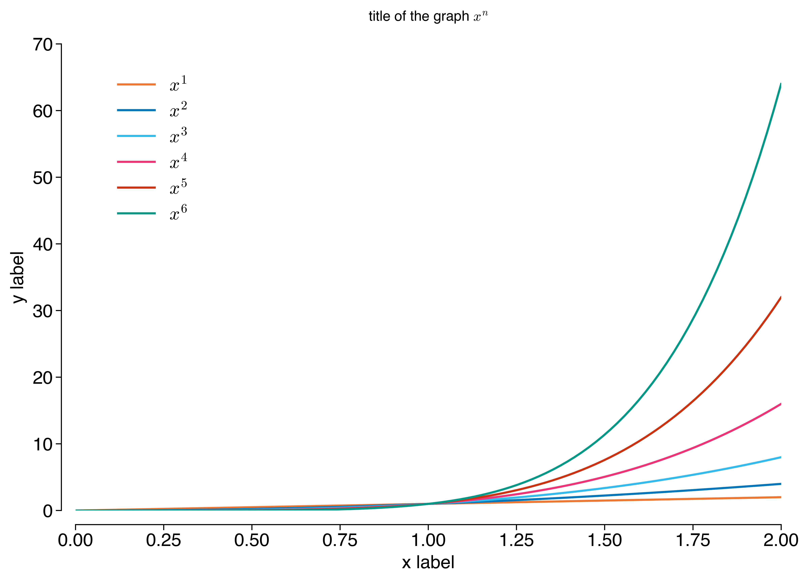

# matplotlib-config

**matplotlib-config** is a set of defaults and utility functions for
[matplotlib 3+](https://www.matplotlib.org).

## Dependencies

* matplotlib3.0.0+ (tested on matplotlib 3.0.3)
* python3 (tested on python 3.7.3)

## Usage

Our use case in generating figures is typically one figure and
corresponding source file per directory.

The easiest way to use this in your project is to copy
`local_mpl_config.py` somewhere (manually or use `git submodule`), and
then create a symlink to it in each figure's sub-directory.

An example directory structure:

```
figures/sample-plot/plot.pdf
figures/sample-plot/plot.py
figures/sample-plot/local_mpl_config.py -> ../local_mpl_config.py
figures/another-example/plot.pdf
figures/another-example/plot.py
figures/another-example/local_mpl_config.py -> ../local_mpl_config.py
figures/local_mpl_config.py
```

In your Python source code, the following is the minimum to get started:

```python
import local_mpl_config as lmc
lmc.initialize()
```

See the [example](#example) for additional usage.

You can also generate documentation using `pydoc`:

```bash
pydoc -w local_mpl_config
```

## Example

Running [example.py](example.py) will produce the following:



## Contributing

Feel free to contribute code or send comments, suggestions, bugs to
calvin@isi.edu.

## LICENSE

[CC0 1.0 Universal](./LICENSE)
